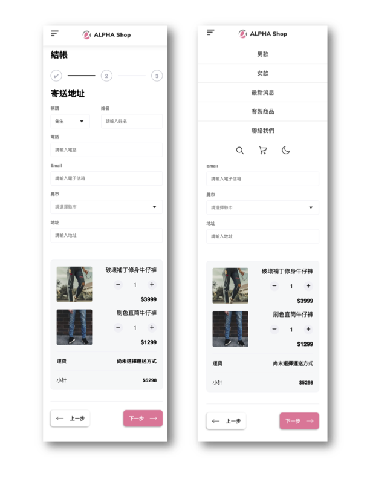
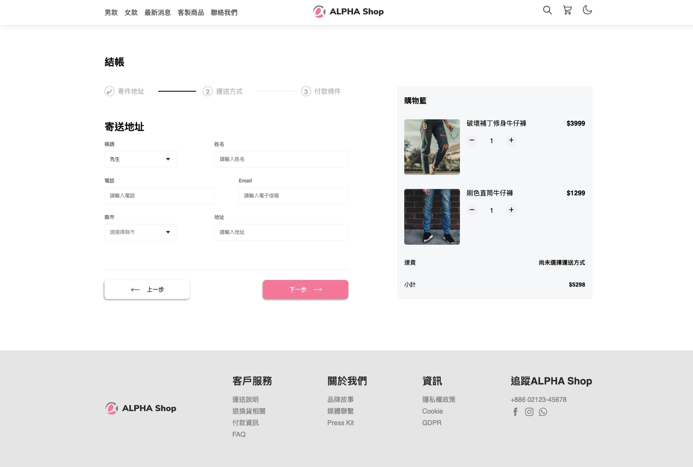

# React Ecommerce purchase Page




## Setup

Please follow the instructions listed below to access the project:

#### 1. Required environment

Before getting this project up and running locally, you should start by having node.js installed on your computer.
It's required to create a Node.js environment to run the project successfully.

#### 2. Clone the repository

Run the following command in a terminal (mac/linux) or windows terminal:

```
git clone https://github.com/JulieDeveloper/react-ecommerce-purchase-page

```

#### 3. Install npm kit

Run the following command in the base directory of this project in the terminal:

```
npm install
```

#### 4. Launch the project

Run the following command in the base directory of this project in the terminal:

```
npm run start
```

#### 5. Completed

The installation is completed once you received the message on the terminal as:

```
"Compiled successfully!"
```

#### 6. Access to the browser

To display the project on your browser, ckick in the link:
http://localhost:3000

#### 7. Terminate the project

To turn off the project by simply pressing `Ctrl+C` in the terminal once you're done.

## Technologies

Project is created with:

- Node.js v14.16.0

Create React App:
- react v18.2.0
- react-dom v18.2.0
- react-scripts v5.0.1
- web-vitals v2.1.4
